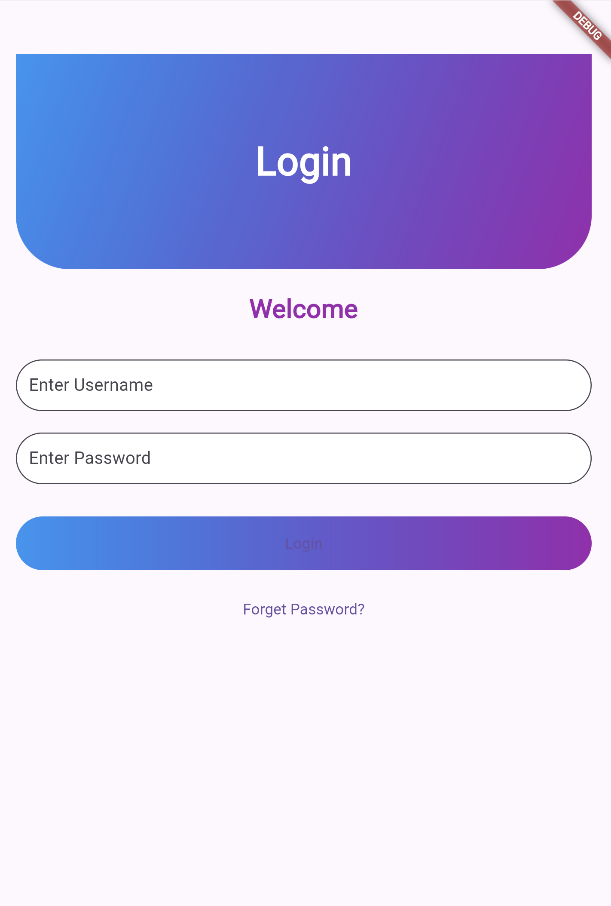
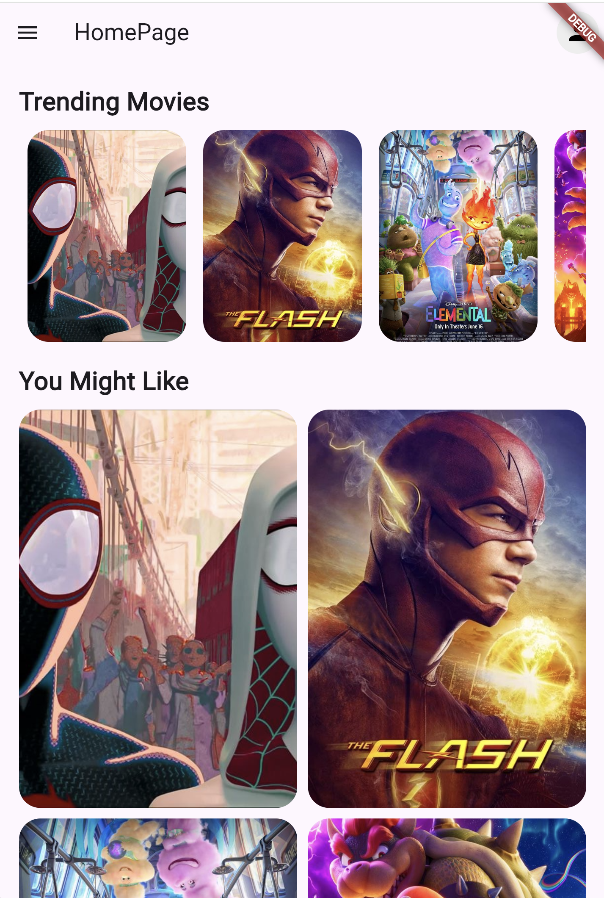
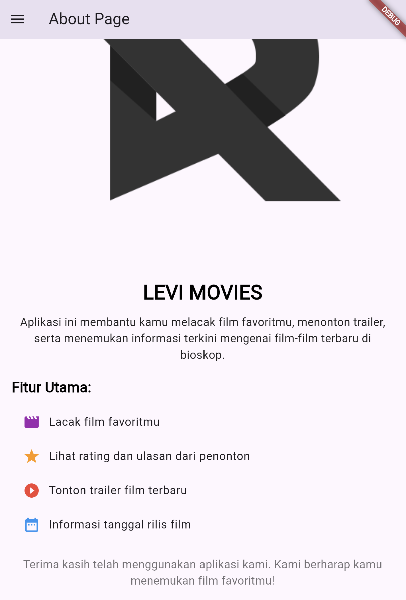
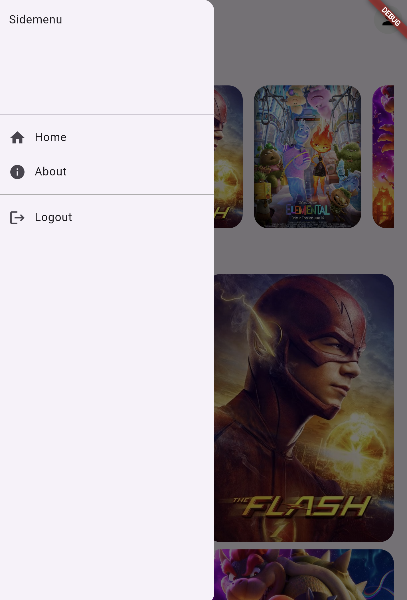

# Tugas Pertemuan 3

Buat Aplikasi dengan flutter yang mengimplementasikan routes, side menu, login, dan local storage. Namun TIDAK BOLEH SAMA PERSIS SEPERTI DI MODUL. Semakin kreatif semakin baik nilainya.

NB : Buat repository baru saja, eg: LabMobile3_Nama_ShiftBaru

Hal yang perlu dikumpulkan :
1. Link Repo berisi Source Code
2. Readme.md yang berisi Penjelasan tiap bagian penting kode dan SS tampilan aplikasi Anda.

Nama : Muhammad Levi Asshidiqi

NIM : H1D022103

Shift Baru: A


file `routerflutter/about_page.dart`
```
import 'package:flutter/material.dart';
import 'package:pertemuan3/router_flutter/side_menu.dart';

class AboutPage extends StatelessWidget {
  const AboutPage({super.key});

  @override
  Widget build(BuildContext context) {
    return Scaffold(
      appBar: AppBar(
        title: const Text('About Page'),
      ),
      drawer: const Sidemenu(),
      body: ListView(
        padding: const EdgeInsets.all(20),
        children: [
          // Header Gambar
          Container(
            height: 500, 
            width: 500, 
            decoration: BoxDecoration(
              borderRadius: BorderRadius.circular(20),
              image: const DecorationImage(
                image: AssetImage('Reviltan_LogoBlack.png'),
                fit:
                    BoxFit.cover, // Atur sesuai kebutuhan: cover, contain, etc.
              ),
            ),
          ),

          const SizedBox(height: 20),
          // Judul Aplikasi
          const Text(
            'LEVI MOVIES',
            style: TextStyle(
              fontSize: 28,
              fontWeight: FontWeight.bold,
              color: Colors.black,
            ),
            textAlign: TextAlign.center,
          ),
          const SizedBox(height: 10),
          // Deskripsi Aplikasi
          const Text(
            'Aplikasi ini membantu kamu melacak film favoritmu, menonton trailer, serta menemukan informasi terkini mengenai film-film terbaru di bioskop.',
            style: TextStyle(
              fontSize: 16,
              color: Colors.black87,
            ),
            textAlign: TextAlign.center,
          ),
          const SizedBox(height: 20),
          // Fitur Aplikasi
          const Text(
            'Fitur Utama:',
            style: TextStyle(
              fontSize: 20,
              fontWeight: FontWeight.bold,
              color: Colors.black,
            ),
          ),
          const SizedBox(height: 10),
          // List Fitur
          const ListTile(
            leading: Icon(Icons.movie, color: Colors.purple),
            title: Text('Lacak film favoritmu'),
          ),
          const ListTile(
            leading: Icon(Icons.star, color: Colors.orange),
            title: Text('Lihat rating dan ulasan dari penonton'),
          ),
          const ListTile(
            leading: Icon(Icons.play_circle_filled, color: Colors.red),
            title: Text('Tonton trailer film terbaru'),
          ),
          const ListTile(
            leading: Icon(Icons.date_range, color: Colors.blue),
            title: Text('Informasi tanggal rilis film'),
          ),
          const SizedBox(height: 20),
          // Footer
          const Text(
            'Terima kasih telah menggunakan aplikasi kami. Kami berharap kamu menemukan film favoritmu!',
            style: TextStyle(
              fontSize: 16,
              color: Colors.black54,
            ),
            textAlign: TextAlign.center,
          ),
        ],
      ),
    );
  }
}

```
1. Imports
Kode mengimpor paket Flutter dan Sidemenu dari folder router_flutter.
Ini diperlukan untuk menggunakan komponen UI dari Flutter dan menu samping untuk navigasi.
2. Class AboutPage
AboutPage didefinisikan sebagai StatelessWidget, yang berarti halaman ini tidak memiliki state yang dapat berubah.
Konstruktor const AboutPage memungkinkan penggunaan widget ini secara efisien.
3. Build Method
Metode build digunakan untuk menggambarkan tampilan halaman AboutPage.
Ini menerima konteks sebagai parameter yang menyediakan informasi tentang posisi widget dalam hierarki.
4. Scaffold
Menggunakan widget Scaffold, yang merupakan struktur dasar untuk halaman dengan material design.
AppBar di atas halaman menampilkan judul "About Page".
Menu samping (drawer) diatur dengan Sidemenu, memungkinkan pengguna untuk mengakses halaman lain.
5. Body dengan ListView
body dari Scaffold menggunakan ListView, memungkinkan konten ditampilkan secara vertikal dan dapat digulir.
Padding ditambahkan untuk memberi jarak di sekeliling konten.
6. Header Gambar
Sebuah Container dengan tinggi dan lebar 500 piksel menampilkan gambar.
Gambar memiliki sudut melengkung (rounded corners) dan diatur dengan BoxFit.cover, sehingga gambar mengisi seluruh area Container.
7. Judul Aplikasi
Menampilkan judul "LEVI MOVIES" dengan ukuran font 28, tebal, dan warna hitam.
Teks diatur agar berada di tengah halaman.
8. Deskripsi Aplikasi
Menyediakan penjelasan tentang fungsi aplikasi, yaitu membantu pengguna melacak film favorit dan mendapatkan informasi terkini.
9. Fitur Aplikasi
Menyediakan bagian "Fitur Utama" yang menjelaskan kemampuan aplikasi.
Menggunakan ListTile untuk setiap fitur, menyertakan ikon dan deskripsi singkat.
10. Footer
Di bagian bawah, terdapat pesan terima kasih kepada pengguna, menunjukkan apresiasi untuk penggunaan aplikasi.

file `router_flutter/home_page.dart`
```
import 'package:flutter/material.dart';
import '/router_flutter/side_menu.dart';
import 'package:shared_preferences/shared_preferences.dart';

class HomePage extends StatefulWidget {
  const HomePage({Key? key}) : super(key: key);

  @override
  _HomePageState createState() => _HomePageState();
}

class _HomePageState extends State<HomePage> {
  var namauser;
  
  // Simulasi data film untuk tampilan grid dan list
  final List<Map<String, String>> movies = [
    {"title": "Spider-Man: Across the Spider-Verse", "image": "spiderman.jpg"},
    {"title": "The Flash (2023)", "image": "flash.jpg"},
    {"title": "Elemental", "image": "elemental.jpg"},
    {"title": "The Super Mario Bros", "image": "mario.jpg"},
    {"title": "Avatar", "image": "avatar.jpg"},
  ];

  @override
  void initState() {
    super.initState();
    _loadUsername();
  }

  void _loadUsername() async {
    SharedPreferences prefs = await SharedPreferences.getInstance();
    namauser = prefs.getString('username');
    setState(() {});
  }

  @override
  Widget build(BuildContext context) {
    return Scaffold(
      appBar: AppBar(
        title: const Text('HomePage'),
        actions: [
          Padding(
            padding: const EdgeInsets.all(8.0),
            child: CircleAvatar(
              backgroundColor: Colors.grey[200],
              child: const Icon(Icons.person, color: Colors.black),
            ),
          ),
        ],
      ),
      drawer: const Sidemenu(),
      body: ListView(
        padding: const EdgeInsets.all(20),
        children: [
          // Header "Trending Movie"
          const Text(
            'Trending Movies',
            style: TextStyle(
              fontSize: 24,
              fontWeight: FontWeight.bold,
            ),
          ),
          const SizedBox(height: 10),
          
          // Tampilan horizontal trailer movie
          SizedBox(
            height: 200,
            child: ListView.builder(
              scrollDirection: Axis.horizontal,
              itemCount: movies.length,
              itemBuilder: (context, index) {
                return Padding(
                  padding: const EdgeInsets.symmetric(horizontal: 8),
                  child: Container(
                    width: 150,
                    decoration: BoxDecoration(
                      borderRadius: BorderRadius.circular(20),
                      image: DecorationImage(
                        image: AssetImage(movies[index]["image"]!),
                        fit: BoxFit.cover,
                      ),
                    ),
                  ),
                );
              },
            ),
          ),
          const SizedBox(height: 20),
          
          // Section "You might like"
          const Text(
            'You Might Like',
            style: TextStyle(
              fontSize: 24,
              fontWeight: FontWeight.bold,
            ),
          ),
          const SizedBox(height: 10),

          // GridView untuk film yang mungkin disukai
          GridView.builder(
            shrinkWrap: true,
            physics: const NeverScrollableScrollPhysics(),
            itemCount: movies.length,
            gridDelegate: const SliverGridDelegateWithFixedCrossAxisCount(
              crossAxisCount: 2,
              mainAxisSpacing: 10,
              crossAxisSpacing: 10,
              childAspectRatio: 0.7,
            ),
            itemBuilder: (context, index) {
              return GestureDetector(
                onTap: () {
                  // Fungsi untuk detail film
                },
                child: Container(
                  decoration: BoxDecoration(
                    borderRadius: BorderRadius.circular(20),
                    image: DecorationImage(
                      image: AssetImage(movies[index]["image"]!),
                      fit: BoxFit.cover,
                    ),
                  ),
                ),
              );
            },
          ),
        ],
      ),
    );
  }
}

```

1. Imports
Mengimpor paket Flutter dan Sidemenu untuk digunakan sebagai menu samping.
Mengimpor shared_preferences untuk menyimpan dan mengambil data pengguna (username).
2. Class HomePage
HomePage didefinisikan sebagai StatefulWidget, yang berarti halaman ini dapat memiliki state yang berubah.
Konstruktor const HomePage digunakan untuk menginisialisasi widget ini.
3. State Class
_HomePageState adalah kelas yang mengelola state untuk HomePage.
Variabel namauser digunakan untuk menyimpan nama pengguna yang diambil dari shared preferences.
4. Data Film
Data film disimpan dalam daftar movies, yang merupakan list dari map. Setiap map berisi judul dan nama file gambar film.
5. initState
Metode initState dipanggil saat widget pertama kali diinisialisasi.
Di sini, _loadUsername dipanggil untuk memuat nama pengguna dari shared preferences.
6. Memuat Nama Pengguna
_loadUsername adalah metode yang mengakses shared preferences untuk mengambil nilai username.
Setelah mengambil nilai, setState dipanggil untuk memperbarui UI jika nilai nama pengguna berhasil diambil.
7. Build Method
Metode build menggambarkan tampilan UI dari HomePage.
Menggunakan Scaffold untuk struktur dasar halaman dengan AppBar, drawer, dan body.
8. AppBar
AppBar memiliki judul "HomePage" dan menampilkan CircleAvatar di sebelah kanan yang berfungsi sebagai ikon pengguna.
9. Drawer
drawer diatur dengan Sidemenu, memungkinkan pengguna untuk mengakses halaman lain.
10. Body dengan ListView
body menggunakan ListView, memungkinkan konten ditampilkan secara vertikal dan dapat digulir.
Konten terdiri dari:
Header "Trending Movies" dengan teks yang diformat.
Tampilan horizontal daftar film menggunakan ListView.builder yang menampilkan gambar film dalam bentuk Container dengan gaya yang ditentukan.
11. Section "You Might Like"
Header "You Might Like" untuk bagian berikutnya.
Menggunakan GridView.builder untuk menampilkan film yang mungkin disukai oleh pengguna.
GridView dirancang dengan dua kolom, dengan gambar film yang ditampilkan dalam Container yang bisa ditekan (GestureDetector), meskipun fungsi untuk menampilkan detail film belum diimplementasikan.

file `router_flutter/login_page.dart`
```
import 'package:flutter/material.dart';
import 'package:shared_preferences/shared_preferences.dart';
import '/router_flutter/home_page.dart';

class LoginPage extends StatefulWidget {
  const LoginPage({super.key});

  @override
  _LoginPageState createState() => _LoginPageState();
}

class _LoginPageState extends State<LoginPage> {
  final TextEditingController _usernameController = TextEditingController();
  final TextEditingController _passwordController = TextEditingController();
  var namauser;

  void _saveUsername() async {
    SharedPreferences prefs = await SharedPreferences.getInstance();
    prefs.setString('username', _usernameController.text);
  }

  _showInput(namacontroller, placeholder, isPassword) {
    return Padding(
      padding: const EdgeInsets.symmetric(vertical: 10.0),
      child: TextField(
        controller: namacontroller,
        obscureText: isPassword,
        decoration: InputDecoration(
          border: OutlineInputBorder(
            borderRadius: BorderRadius.circular(30.0),
          ),
          filled: true,
          fillColor: Colors.white,
          hintText: placeholder,
        ),
      ),
    );
  }

  _showDialog(pesan, alamat) {
    return showDialog(
      context: context,
      builder: (context) {
        return AlertDialog(
          title: Text(pesan),
          actions: [
            TextButton(
              child: const Text('OK'),
              onPressed: () {
                Navigator.push(
                  context,
                  MaterialPageRoute(builder: (context) => alamat),
                );
              },
            ),
          ],
        );
      },
    );
  }

  @override
  Widget build(BuildContext context) {
    return Scaffold(
      body: ListView(
        padding: const EdgeInsets.symmetric(horizontal: 20, vertical: 50),
        children: [
          // Bagian header gradient
          Container(
            height: 200,
            decoration: const BoxDecoration(
              gradient: LinearGradient(
                colors: [Colors.blue, Colors.purple],
                begin: Alignment.topLeft,
                end: Alignment.bottomRight,
              ),
              borderRadius: BorderRadius.only(
                bottomLeft: Radius.circular(50),
                bottomRight: Radius.circular(50),
              ),
            ),
            child: const Center(
              child: Text(
                'Login',
                style: TextStyle(
                  fontSize: 36,
                  fontWeight: FontWeight.bold,
                  color: Colors.white,
                ),
              ),
            ),
          ),
          const SizedBox(height: 20),
          const Text(
            'Welcome',
            style: TextStyle(
              fontSize: 24,
              fontWeight: FontWeight.bold,
              color: Colors.purple,
            ),
            textAlign: TextAlign.center,
          ),
          const SizedBox(height: 20),
          // Input field Username
          _showInput(_usernameController, 'Enter Username', false),
          // Input field Password
          _showInput(_passwordController, 'Enter Password', true),
          const SizedBox(height: 20),
          // Tombol Login dengan gradient
          Container(
            height: 50,
            decoration: BoxDecoration(
              gradient: const LinearGradient(
                colors: [Colors.blue, Colors.purple],
              ),
              borderRadius: BorderRadius.circular(30),
            ),
            child: ElevatedButton(
              onPressed: () {
                if (_usernameController.text == 'admin' &&
                    _passwordController.text == 'admin') {
                  _saveUsername();
                  _showDialog('Anda Berhasil Login', const HomePage());
                } else {
                  _showDialog('Username dan password salah', const LoginPage());
                }
              },
              style: ElevatedButton.styleFrom(
                backgroundColor: Colors.transparent,
                shadowColor: Colors.transparent,
                shape: RoundedRectangleBorder(
                  borderRadius: BorderRadius.circular(30),
                ),
              ),
              child: const Text('Login'),
            ),
          ),
          const SizedBox(height: 20),
          Center(
            child: TextButton(
              onPressed: () {
                // Add your forgot password functionality here
              },
              child: const Text('Forget Password?'),
            ),
          ),
        ],
      ),
    );
  }
}

```

1. Imports
Mengimpor paket Flutter dan shared_preferences untuk menyimpan username.
Mengimpor HomePage untuk navigasi setelah login berhasil.
2. Class LoginPage
LoginPage didefinisikan sebagai StatefulWidget, yang memungkinkan halaman memiliki state yang dapat berubah.
Konstruktor const LoginPage digunakan untuk menginisialisasi widget ini.
3. State Class
_LoginPageState adalah kelas yang mengelola state untuk LoginPage.
Terdapat dua TextEditingController: _usernameController dan _passwordController, yang digunakan untuk mengambil input dari pengguna.
Variabel namauser dideklarasikan, tetapi tidak digunakan di sini.
4. Menyimpan Username
Metode _saveUsername menggunakan shared_preferences untuk menyimpan username yang dimasukkan pengguna.
5. Menampilkan Input
_showInput adalah metode yang mengembalikan widget TextField untuk input username dan password.
Metode ini memiliki parameter untuk menentukan kontroler, placeholder, dan apakah input tersebut harus disembunyikan (untuk password).
6. Menampilkan Dialog
_showDialog adalah metode untuk menampilkan dialog dengan pesan yang diberikan.
Dialog memiliki tombol "OK" yang akan mengarahkan pengguna ke halaman yang ditentukan saat ditekan.
7. Build Method
Metode build menggambarkan tampilan UI dari LoginPage.
Menggunakan Scaffold untuk struktur dasar halaman dengan body yang berisi:
8. Header dengan Gradient
Container dengan gradient yang menarik dan judul "Login" di tengahnya.
9. Selamat Datang
Teks "Welcome" yang ditampilkan di tengah dengan gaya yang menonjol.
10. Input Fields
Dua input field ditambahkan untuk username dan password menggunakan metode _showInput.
11. Tombol Login
Container untuk tombol login dengan gradient yang sama.
Tombol memiliki fungsi untuk memverifikasi username dan password. Jika benar (username dan password sama dengan 'admin'), username akan disimpan dan dialog "Anda Berhasil Login" akan ditampilkan. Jika salah, dialog yang menampilkan pesan kesalahan akan muncul.
12. Tombol Lupa Password
Teks "Forget Password?" sebagai tombol yang dapat digunakan untuk menambahkan fungsionalitas pemulihan password di masa depan.

file `router_flutter/side_menu.dart`
```
import 'package:flutter/material.dart';
import 'package:pertemuan3/router_flutter/home_page.dart';
import 'about_page.dart';
import 'package:shared_preferences/shared_preferences.dart';
import 'login_page.dart';

class Sidemenu extends StatelessWidget {
  const Sidemenu({Key? key}) : super(key: key);

  Future<void> _logout(BuildContext context) async {
    // Hapus username dari shared preferences (jika ada)
    SharedPreferences prefs = await SharedPreferences.getInstance();
    await prefs.clear();

    // Navigasi ke halaman login (ganti '/login' dengan route ke halaman login Anda)
    Navigator.of(context).pushReplacementNamed('/login');
  }

  @override
  Widget build(BuildContext context) {
    return Drawer(
      child: ListView(
        children: [
          const DrawerHeader(
            child: Text('Sidemenu'),
          ),
          ListTile(
            leading: const Icon(Icons.home),
            title: const Text('Home'),
            onTap: () {
              // Navigasi ke halaman home
              Navigator.push(
                context,
                MaterialPageRoute(
                  builder: (context) => const HomePage(),
                ),
              );
            },
          ),
          ListTile(
            leading: const Icon(Icons.info),
            title: const Text('About'),
            onTap: () {
              // Navigasi ke halaman about
              Navigator.push(
                context,
                MaterialPageRoute(
                  builder: (context) => const AboutPage(),
                ),
              );
            },
          ),
          // garis
          const Divider(
            thickness: 1,
            color: Colors.grey,
          ),
          ListTile(
            leading: const Icon(Icons.logout),
            title: const Text('Logout'),
            onTap: () {
              // Navigasi ke halaman login
              Navigator.of(context).pushReplacementNamed(
                  '/'); // Atau '/login' jika Anda mendefinisikan rute tersebut
            },
          ),
        ],
      ),
    );
  }
}


```

1. Imports
Mengimpor paket flutter/material.dart untuk membangun antarmuka pengguna.
Mengimpor halaman lain seperti HomePage, AboutPage, dan LoginPage.
Mengimpor shared_preferences untuk menyimpan dan mengambil data pengguna.
2. Class Sidemenu
Sidemenu adalah kelas yang merupakan turunan dari StatelessWidget, yang berarti kelas ini tidak memiliki state yang bisa berubah.
3. Metode Logout
_logout adalah metode asinkron yang digunakan untuk menghapus username dari shared_preferences dan menavigasi pengguna kembali ke halaman login.
Menggunakan await prefs.clear(); untuk menghapus semua data yang disimpan.
Navigasi dilakukan dengan Navigator.of(context).pushReplacementNamed('/login');, yang mengganti halaman saat ini dengan halaman login.
4. Build Method
Metode build menggambarkan tampilan dari Sidemenu.
Menggunakan Drawer sebagai wadah untuk menu samping, yang berisi ListView untuk menampilkan berbagai opsi.
5. Drawer Header
DrawerHeader digunakan untuk menampilkan judul atau informasi di bagian atas menu, di sini hanya menampilkan teks "Sidemenu".
6. Menu Item
Home: Menggunakan ListTile untuk menampilkan opsi "Home".
Saat diklik, akan menavigasi ke HomePage dengan menggunakan MaterialPageRoute.
About: Opsi "About" juga menggunakan ListTile.
Saat diklik, akan menavigasi ke AboutPage.
7. Divider
Divider ditambahkan untuk memisahkan antara daftar menu, memberikan tampilan yang lebih teratur.
8. Logout Item
ListTile untuk logout, yang menampilkan ikon logout dan teks "Logout".
Saat diklik, metode _logout akan dipanggil untuk menghapus data pengguna dan menavigasi kembali ke halaman login.

file `mian.dart`
```
import 'package:flutter/material.dart';
import 'router_flutter/login_page.dart';
import 'router_flutter/home_page.dart'; // Pastikan untuk mengimpor halaman home
import 'router_flutter/about_page.dart'; // Pastikan untuk mengimpor halaman about

void main() {
  runApp(const MyApp());
}

class MyApp extends StatelessWidget {
  const MyApp({super.key});

  @override 
  Widget build(BuildContext context) {
    return MaterialApp(
      title: 'Flutter Menu',
      initialRoute: '/', // Rute awal
      routes: {
        '/': (context) => const LoginPage(), // Halaman login
        '/home': (context) => const HomePage(), // Halaman home
        '/about': (context) => const AboutPage(), // Halaman about
      },
    );
  }
}


```

1. Imports
Mengimpor package:flutter/material.dart, yang merupakan paket utama untuk membangun antarmuka pengguna di Flutter.
Mengimpor LoginPage, HomePage, dan AboutPage dari folder router_flutter, yang merupakan halaman-halaman yang akan dinavigasi dalam aplikasi.
2. Fungsi Main
void main() adalah titik masuk aplikasi. Di sini, aplikasi diinisialisasi dengan menjalankan MyApp.
runApp(const MyApp()) memulai aplikasi Flutter dengan widget MyApp.
3. Kelas MyApp
MyApp adalah kelas yang merupakan turunan dari StatelessWidget, yang berarti tidak memiliki state yang bisa berubah.
Kelas ini bertanggung jawab untuk mengonfigurasi aplikasi dan menyusun widget utama.
4. Metode Build
Metode build membangun struktur antarmuka pengguna aplikasi.
Menggunakan MaterialApp, yang menyediakan desain material dan beberapa fungsionalitas dasar aplikasi.
5. Properti MaterialApp
title: Mengatur judul aplikasi, yang akan ditampilkan di bilah tugas atau ikon aplikasi.
initialRoute: Menentukan rute awal aplikasi saat pertama kali diluncurkan. Dalam hal ini, ditetapkan ke '/', yang berarti aplikasi akan menampilkan LoginPage sebagai halaman awal.
6. Rute Aplikasi
routes: Mendefinisikan peta rute untuk aplikasi.
'/': Menunjuk pada LoginPage. Ini adalah halaman pertama yang ditampilkan saat aplikasi diluncurkan.
'/home': Menunjuk pada HomePage, yang akan diakses ketika pengguna berhasil login.
'/about': Menunjuk pada AboutPage, yang dapat diakses dari menu atau navigasi dalam aplikasi.

## Screenshot
Contoh :





